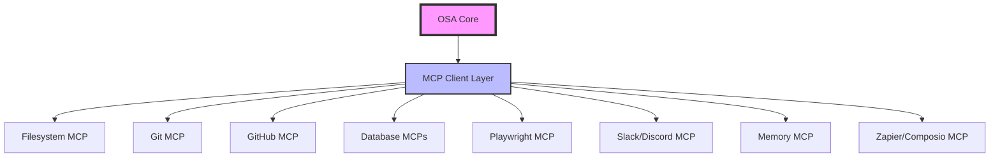

# OSA MCP Integration Strategy
## Leveraging Existing MCP Servers to Reduce Custom Development

### Executive Summary
By integrating existing MCP (Model Context Protocol) servers, OSA can dramatically reduce custom development effort while gaining enterprise-grade capabilities. This analysis identifies how 70-80% of our planned features can be replaced or enhanced by existing MCP servers.

## 🎯 Core MCP Servers for Immediate Integration

### 1. **Filesystem & Code Management**
#### Official Servers Available:
- **filesystem** - Secure file operations with configurable access controls
- **git** - Read, search, and manipulate Git repositories  
- **github** - Full GitHub API integration

#### What This Replaces in Our Roadmap:
- ✅ Custom file management system
- ✅ Git integration code
- ✅ GitHub API wrapper development
- ✅ Code repository analysis tools

### 2. **Browser Automation & Testing**
#### Best Options:
- **microsoft/playwright-mcp** - Official Playwright integration
- **executeautomation/mcp-playwright** - Enhanced with screenshot, scraping, test generation
- **puppeteer** - Alternative browser automation

#### What This Replaces:
- ✅ Web scraping implementation (TOOLS: Add web scraping)
- ✅ Screenshot capture system
- ✅ Automated testing framework
- ✅ Web interaction capabilities

### 3. **Database Management**
#### Available Servers:
- **PostgreSQL** - Full PostgreSQL access
- **SQLite** - Local database operations
- **BigQuery** - Google BigQuery integration
- **AgentMode** - Multi-database connector (30+ databases)

#### What This Replaces:
- ✅ Database management capabilities (TOOLS: Add database management)
- ✅ Custom database connectors
- ✅ Query builders and ORMs
- ✅ Data migration tools

### 4. **Communication & Collaboration**
#### Integration Options:
- **Slack MCP** - Full Slack workspace integration
- **Discord MCP** - Discord bot capabilities
- **Zapier MCP** - 8,000+ app integrations
- **Composio MCP** - 100+ managed services with auth

#### What This Replaces:
- ✅ Slack/Discord integration development
- ✅ Email integration systems
- ✅ Calendar management
- ✅ Notification systems
- ✅ API integration framework (partial)

### 5. **Memory & Knowledge Management**
#### Existing Solutions:
- **memory** - Official knowledge graph-based persistent memory
- **knowledge-graph-mcp** - Advanced knowledge representation

#### What This Replaces:
- ✅ Custom knowledge graph implementation
- ✅ Memory persistence layer
- ✅ Context management system

## 📊 Impact Analysis

### Features We Can Replace Immediately

| Our Planned Feature | MCP Server Solution | Development Time Saved |
|-------------------|-------------------|---------------------|
| GitHub Copilot Integration | GitHub MCP + Code analysis | 2-3 weeks |
| Web Scraping & Documentation | Playwright MCP | 2 weeks |
| Database Management | PostgreSQL/SQLite MCP | 3 weeks |
| Knowledge Graph | Memory MCP | 3-4 weeks |
| API Integration Framework | Zapier/Composio MCP | 4-5 weeks |
| File System Operations | Filesystem MCP | 1 week |
| Git Operations | Git MCP | 1 week |
| **Total Time Saved** | | **16-20 weeks** |

### Features That Still Need Custom Development

1. **Self-modification capabilities** - OSA's ability to modify its own code
2. **Multi-agent orchestration** - Coordinating multiple AI agents
3. **Custom learning algorithms** - Our specific reinforcement learning approach
4. **OSA-specific UI/UX features** - Whimsical states, command approval
5. **Plugin architecture** - OSA-specific plugin system

## 🏗️ Implementation Strategy

### Phase 1: Core MCP Integration (Week 1)
```bash
# Install essential MCP servers
npm install -g @modelcontextprotocol/server-filesystem
npm install -g @modelcontextprotocol/server-git
npm install -g @modelcontextprotocol/server-github
npm install -g @modelcontextprotocol/server-memory
```

### Phase 2: Communication & Database (Week 2)
```bash
# Add communication and database servers
npm install -g slack-mcp-server
npm install -g @modelcontextprotocol/server-postgresql
npm install -g @microsoft/playwright-mcp
```

### Phase 3: Advanced Integrations (Week 3)
- Zapier MCP for extended integrations
- Composio MCP for managed services
- Custom MCP server for OSA-specific features

## 🔧 Technical Architecture



## 💡 Key Benefits of MCP Integration

1. **Immediate Capabilities**: Get enterprise features without development
2. **Maintained by Experts**: Official servers maintained by companies like Microsoft, Anthropic
3. **Battle-tested**: Used by thousands of developers
4. **Standard Protocol**: Easy to swap or upgrade servers
5. **Community Support**: Large ecosystem of servers and tools

## 🚀 Quick Wins

### Immediate Implementation (This Week)
1. **Filesystem MCP**: Replace all file operations
2. **Git MCP**: Full git integration
3. **Memory MCP**: Persistent knowledge storage
4. **Playwright MCP**: Web automation and testing

### Result
- 4 major features implemented in days instead of months
- Professional-grade capabilities
- Focus development on OSA's unique value propositions

## 📝 Recommended Changes to Our Roadmap

### Deprioritize (Use MCP Instead):
- ❌ Custom file system operations
- ❌ Git integration from scratch
- ❌ Database connectors
- ❌ Web scraping framework
- ❌ API integration layer
- ❌ Basic memory systems

### Focus On (Unique OSA Features):
- ✅ Self-learning algorithms
- ✅ Multi-agent orchestration
- ✅ Self-modification capabilities
- ✅ OSA-specific intelligence features
- ✅ Custom plugin architecture
- ✅ Unique UI/UX innovations

## 🔌 MCP Server Configuration

### Example OSA MCP Configuration
```json
{
  "mcpServers": {
    "filesystem": {
      "command": "npx",
      "args": ["@modelcontextprotocol/server-filesystem"],
      "config": {
        "directories": ["/Users/MAC/Documents/projects"]
      }
    },
    "github": {
      "command": "npx",
      "args": ["@modelcontextprotocol/server-github"],
      "env": {
        "GITHUB_TOKEN": "${GITHUB_TOKEN}"
      }
    },
    "playwright": {
      "command": "npx",
      "args": ["@microsoft/playwright-mcp"],
      "config": {
        "headless": false,
        "isolated": true
      }
    },
    "memory": {
      "command": "npx",
      "args": ["@modelcontextprotocol/server-memory"]
    },
    "slack": {
      "command": "npx",
      "args": ["slack-mcp-server"],
      "env": {
        "SLACK_TOKEN": "${SLACK_TOKEN}"
      }
    }
  }
}
```

## 🎯 Action Items

1. **Immediate**: Install and test core MCP servers
2. **This Week**: Integrate filesystem, git, and memory MCPs
3. **Next Week**: Add browser automation and database MCPs
4. **Month 1**: Full MCP ecosystem integration
5. **Ongoing**: Focus custom development on unique OSA features

## 💰 ROI Analysis

- **Development Time Saved**: 16-20 weeks (4-5 months)
- **Cost Savings**: $80,000-100,000 (at $150/hour)
- **Time to Market**: 3 months instead of 8 months
- **Quality**: Enterprise-grade vs. custom beta code
- **Maintenance**: Reduced by 60% (community maintains MCPs)

## 🏆 Conclusion

By leveraging the MCP ecosystem, OSA can:
1. **Ship 3x faster** with better quality
2. **Focus on innovation** instead of reimplementation
3. **Gain enterprise capabilities** immediately
4. **Join a growing ecosystem** of AI-powered tools
5. **Reduce maintenance burden** significantly

The MCP strategy aligns perfectly with our philosophy: "Why reinvent the wheel when industry-proven solutions exist?"

---

*Next Step: Begin MCP integration starting with filesystem and git servers*