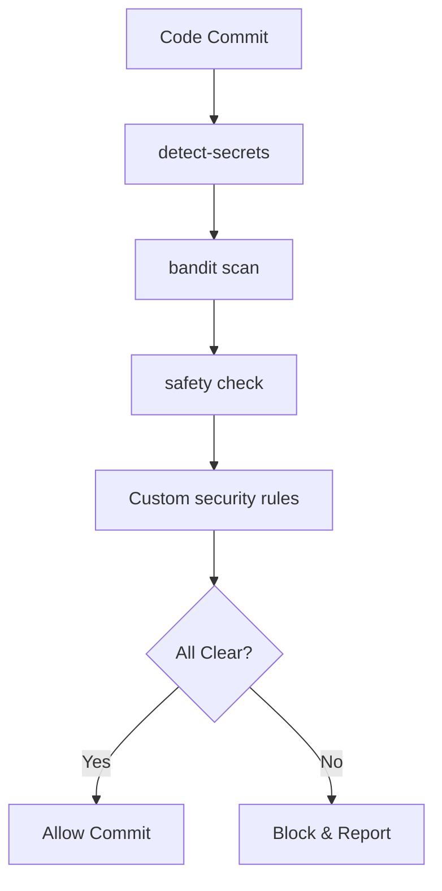

# Development Tools & Quality Framework

## 📋 Overview

This document provides a comprehensive guide to all development tools, quality assurance frameworks, and best practices implemented in the OSA project. These tools ensure code quality, security, performance, and maintainability.

## 🛠️ Tool Categories

### 1. Code Quality & Formatting
- **Black**: Automated code formatting
- **isort**: Import statement organization
- **Prettier**: YAML/JSON formatting
- **EditorConfig**: Consistent editor settings

### 2. Static Analysis & Linting
- **flake8**: Python linting with plugins
- **pylint**: Advanced Python analysis
- **mypy**: Static type checking
- **Custom Quality Checker**: OSA-specific rules

### 3. Security & Vulnerability Scanning
- **bandit**: Security issue detection
- **safety**: Vulnerability database scanning
- **detect-secrets**: Secret detection
- **Custom Security Analyzer**: Domain-specific checks

### 4. Testing & Coverage
- **pytest**: Testing framework
- **pytest-cov**: Coverage reporting  
- **pytest-asyncio**: Async testing support
- **pytest-benchmark**: Performance testing

### 5. Pre-commit Automation
- **pre-commit**: Git hook management
- **Multiple hooks**: Automated quality gates

### 6. Performance & Monitoring
- **Performance Monitor**: Real-time system monitoring
- **Memory Profiler**: Memory usage analysis
- **Benchmark Runner**: Automated performance tests

### 7. Dependency Management
- **pip-audit**: Vulnerability scanning
- **Custom Dependency Checker**: License & security analysis
- **pipdeptree**: Dependency visualization

## 🚀 Quick Start

### Initial Setup

```bash
# Clone repository
git clone https://github.com/prakashgbid/omnimind.git
cd omnimind

# Run automated setup
python tools/dev_setup.py

# Or manual setup
python -m venv venv
source venv/bin/activate  # On Windows: venv\Scripts\activate
pip install -r requirements.txt
pip install -e ".[dev]"
pre-commit install
```

### Daily Development Workflow

```bash
# Before starting work
./scripts/check-quality.sh

# Format code
./scripts/format-code.sh

# Run tests
./scripts/run-tests.sh

# Security scan
./scripts/security-scan.sh

# Performance check
python tools/performance_monitor.py --monitor --duration 30
```

## 📊 Quality Gates

### Pre-commit Hooks (Automatic)

Every commit triggers:
- ✅ Code formatting (Black, isort)
- ✅ Linting (flake8, pylint) 
- ✅ Type checking (mypy)
- ✅ Security scanning (bandit, detect-secrets)
- ✅ Custom quality rules
- ✅ File consistency checks

### CI/CD Pipeline (GitHub Actions)

Pull requests and pushes trigger:
- ✅ Pre-commit validation
- ✅ Multi-version testing (Python 3.9, 3.10, 3.11)
- ✅ Security scanning
- ✅ Performance benchmarking
- ✅ Documentation building
- ✅ Dependency analysis
- ✅ Package building

### Quality Metrics Thresholds

| Metric | Threshold | Action |
|--------|-----------|--------|
| Test Coverage | ≥80% | ❌ Block merge |
| Pylint Score | ≥8.0/10 | ❌ Block merge |
| Security Issues | 0 Critical/High | ❌ Block merge |
| Type Coverage | ≥90% | ⚠️ Warning |
| Cyclomatic Complexity | ≤10 | ⚠️ Warning |

## 🔧 Configuration Files

### Core Configuration

- **pyproject.toml**: Project metadata and tool configuration
- **setup.cfg**: Legacy tool configuration (flake8)
- **.pylintrc**: Pylint configuration
- **pytest.ini**: Testing configuration

### Pre-commit Configuration

- **.pre-commit-config.yaml**: Hook definitions
- **.pre-commit-hooks.yaml**: Custom hook metadata

### Security Configuration  

- **.bandit**: Security scanning configuration
- **.secrets.baseline**: Approved secrets baseline

### CI/CD Configuration

- **.github/workflows/quality-gates.yml**: GitHub Actions pipeline
- **.github/workflows/tests.yml**: Test automation

## 🧰 Custom Tools

### 1. Quality Checker (`tools/quality_checks.py`)

**Purpose**: OSA-specific code quality rules and anti-pattern detection

**Features**:
- God class detection (>20 methods)
- Missing docstrings on public APIs
- Too many parameters (>8)
- Missing type annotations
- Async functions without await
- Bare except clauses
- Dangerous imports
- Architecture violations

**Usage**:
```bash
python tools/quality_checks.py
python tools/quality_checks.py /path/to/project
```

**Custom Rules**:
- `OSA001`: God class detected
- `OSA002`: Missing docstring  
- `OSA003`: Too many parameters
- `OSA004`: Missing type annotation
- `OSA005`: Async without await
- `OSA006`: Bare except clause
- `OSA007`: Empty except block
- `OSA008`: Dangerous import
- `OSA009`: Sync HTTP in async
- `OSA010`: Print instead of logging

### 2. Security Analyzer (`tools/quality_checks.py`)

**Purpose**: Domain-specific security pattern detection

**Features**:
- Hardcoded secrets detection
- SQL injection patterns
- Path traversal vulnerabilities  
- Unsafe deserialization

**Custom Rules**:
- `SEC001`: Hardcoded secrets
- `SEC002`: SQL injection risk
- `SEC003`: Path traversal risk
- `SEC004`: Unsafe deserialization

### 3. Architecture Analyzer (`tools/quality_checks.py`)

**Purpose**: Architectural pattern validation

**Features**:
- Circular import detection
- Layer violation checking
- Dependency rule enforcement
- File organization validation

**Custom Rules**:
- `ARCH001`: Circular imports
- `ARCH002`: Layer violations
- `ARCH003`: Dependency violations  
- `ARCH004`: Oversized files

### 4. Dependency Checker (`tools/dependency_check.py`)

**Purpose**: Comprehensive dependency analysis

**Features**:
- Vulnerability scanning with safety
- License compatibility checking
- Outdated package detection
- Unused dependency identification
- Dependency conflict resolution

**Usage**:
```bash
python tools/dependency_check.py
python tools/dependency_check.py /path/to/project
```

**Report Sections**:
- 🔒 Security vulnerabilities
- 📄 License compatibility
- 📅 Outdated packages
- 🗑️ Unused dependencies
- ⚔️ Version conflicts

### 5. Performance Monitor (`tools/performance_monitor.py`)

**Purpose**: Real-time performance monitoring and profiling

**Features**:
- System resource monitoring
- Memory usage profiling
- Function execution timing
- Performance benchmark running
- Bottleneck identification

**Usage**:
```bash
# System monitoring
python tools/performance_monitor.py --monitor --duration 60

# Function profiling
from tools.performance_monitor import PerformanceProfiler

@PerformanceProfiler.profile_function
def my_function():
    # Function code
    pass
```

### 6. Development Setup (`tools/dev_setup.py`)

**Purpose**: Automated development environment setup

**Features**:
- Virtual environment creation
- Dependency installation
- Tool configuration
- Pre-commit hook setup
- Development script generation

**Usage**:
```bash
python tools/dev_setup.py
python tools/dev_setup.py --project-root /path/to/project
```

## 📝 Development Scripts

### Generated Scripts (`scripts/`)

- **check-quality.sh**: Run all quality checks
- **run-tests.sh**: Execute test suite with coverage
- **format-code.sh**: Auto-format codebase
- **security-scan.sh**: Security analysis
- **dev-server.sh**: Start development environment

### Script Permissions

All scripts are automatically made executable (`chmod +x`) during setup.

## 🔍 Quality Enforcement

### Git Hooks

- **pre-commit**: Quality gate before commit
- **commit-msg**: Commit message validation
- **pre-push**: Final validation before push

### IDE Integration

**VS Code Settings** (`.vscode/settings.json`):
```json
{
    "python.linting.enabled": true,
    "python.linting.flake8Enabled": true,
    "python.linting.pylintEnabled": true,
    "python.linting.mypyEnabled": true,
    "python.formatting.provider": "black",
    "python.sortImports.provider": "isort",
    "editor.formatOnSave": true,
    "editor.codeActionsOnSave": {
        "source.organizeImports": true
    }
}
```

### Command Line Usage

```bash
# Format code
black .
isort .

# Run linters
flake8 src/ tests/
pylint src/ --fail-under=8.0
mypy src/

# Security checks  
bandit -r src/
safety check
detect-secrets scan --baseline .secrets.baseline

# Run tests
pytest --cov=src --cov-report=html --cov-fail-under=80

# Custom checks
python tools/quality_checks.py
python tools/dependency_check.py
```

## 📈 Metrics & Reporting

### Coverage Reports

- **Terminal**: Real-time coverage display
- **HTML**: Detailed coverage report (`htmlcov/index.html`)
- **XML**: CI/CD integration (`coverage.xml`)

### Quality Reports

- **Flake8**: Code quality issues
- **Pylint**: Detailed code analysis with scores
- **Bandit**: Security findings with risk levels
- **Custom**: OSA-specific issues with suggestions

### Performance Reports

- **System Metrics**: CPU, memory, I/O usage
- **Benchmark Results**: Performance baselines
- **Memory Analysis**: Usage patterns and leaks
- **Execution Profiles**: Function-level timing

## 🛡️ Security Framework

### Multi-Layer Security

1. **Static Analysis**: Code pattern detection
2. **Dependency Scanning**: Known vulnerability database
3. **Secret Detection**: Prevents credential leaks
4. **Dynamic Analysis**: Runtime behavior monitoring

### Security Workflow



### Vulnerability Response

1. **Detection**: Automated scanning finds issue
2. **Assessment**: Severity and impact evaluation
3. **Prioritization**: Critical/High/Medium/Low
4. **Remediation**: Fix or mitigation plan
5. **Verification**: Confirm fix effectiveness

## 🔄 Continuous Improvement

### Quality Metrics Tracking

- **Weekly**: Quality metrics review
- **Monthly**: Tool effectiveness analysis
- **Quarterly**: Process improvement sessions

### Tool Evolution

- **Regular Updates**: Keep tools current
- **Custom Rule Updates**: Adapt to project needs
- **Performance Optimization**: Reduce check times
- **New Tool Integration**: Evaluate emerging tools

## 🆘 Troubleshooting

### Common Issues

**Pre-commit Hook Failures**:
```bash
# Fix formatting issues
black .
isort .

# Update pre-commit
pre-commit autoupdate
pre-commit run --all-files
```

**Type Check Errors**:
```bash
# Ignore specific errors (temporary)
# type: ignore

# Fix missing imports
pip install types-requests types-PyYAML
```

**Performance Issues**:
```bash
# Disable slow checks temporarily  
SKIP=pylint,mypy git commit -m "Quick fix"

# Optimize tool configuration
# Edit pyproject.toml or .pylintrc
```

### Getting Help

1. Check tool documentation
2. Review configuration files
3. Check GitHub issues
4. Ask in team discussions

---

*This framework ensures high code quality while maintaining developer productivity. All tools are configured to work together seamlessly.*